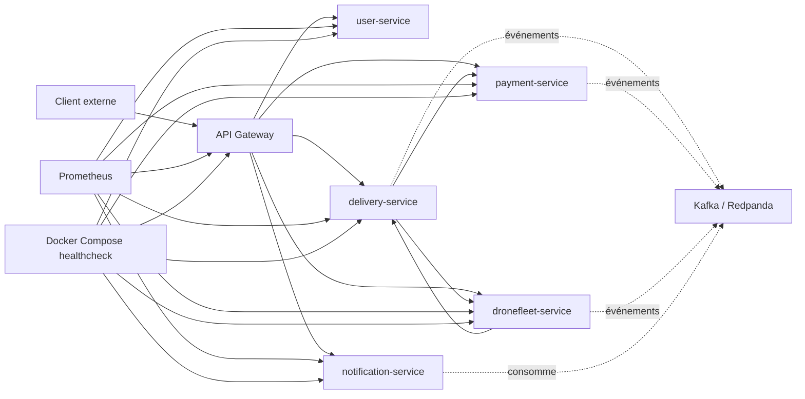
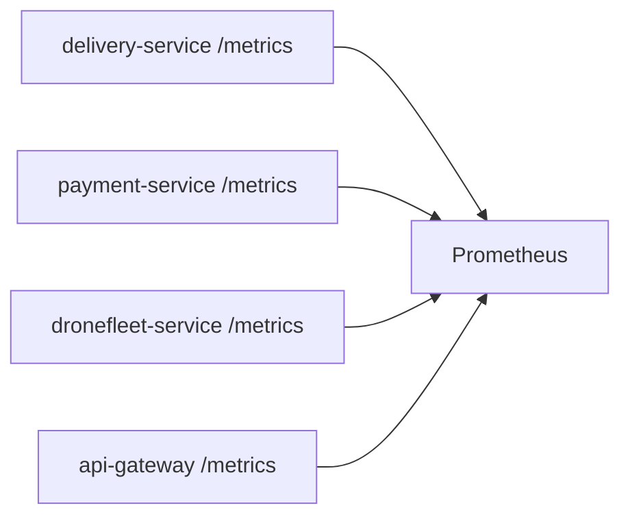

# Rapport d’Architecture Logicielle

## 1. Introduction

Dans ce projet, l’application est construite sous forme de microservices déployés avec Docker Compose. Chaque service porte une responsabilité métier précise :

- `api-gateway`
- `user-service`
- `delivery-service`
- `payment-service`
- `dronefleet-service`
- `notification-service`

L’objectif de l’architecture est double :

- découpler les responsabilités métier pour faciliter l’évolution du système
- améliorer la résilience, l’observabilité et la maintenabilité de l’ensemble

Pour répondre à ces objectifs, plusieurs patterns d’architecture et d’observabilité ont été mis en place :

- API Gateway
- Health Check
- Metrics / Observability
- Event Sourcing
- Circuit Breaker
- Saga

Ce document présente leur rôle, leur implémentation dans le projet, ainsi que leur contribution aux attributs de qualité du système.

---

## 2. Vue d’ensemble de l’architecture

Le système repose sur un point d’entrée unique, `api-gateway`, qui reçoit les requêtes externes puis les redirige vers les microservices internes. Les services communiquent entre eux via HTTP et événements métier. L’observabilité est assurée par les endpoints de santé et de métriques, collectés par Docker Compose et Prometheus.

### Schéma logique



---

## 3. Pattern 1: API Gateway

## Rôle

Le pattern `API Gateway` consiste à placer un service unique entre les clients externes et les microservices internes. Au lieu d’exposer directement chaque service, toutes les requêtes passent par une seule API d’entrée.

## Objectifs

- centraliser l’accès externe
- masquer la topologie interne des microservices
- mutualiser la sécurité
- simplifier les appels côté client
- contrôler le routage des requêtes

## Implémentation dans le projet

Le service `api-gateway` joue ce rôle. Il contient :

- un contrôleur principal qui reçoit les routes `/api/**`
- des proxys HTTP basés sur `RestTemplate`
- une gestion JWT pour sécuriser les appels
- une redirection vers les services métier internes

Exemples de routes exposées :

- `/api/users/**`
- `/api/deliveries/**`
- `/api/payments/**`
- `/api/drones/**`
- `/api/notifications/**`

Le client ne parle donc qu’au gateway, jamais directement aux autres services.

## Intérêt architectural

Ce pattern améliore :

- la sécurité, car un seul point d’entrée est exposé
- la maintenabilité, car les services internes peuvent évoluer sans casser les clients
- la gouvernance des échanges, car le routage est centralisé

---

## 4. Pattern 2: Health Check

## Rôle

Le pattern `Health Check` permet à chaque microservice d’exposer son état courant via un endpoint dédié.

Endpoint exposé :

- `GET /health`

Exemple de réponse :

```json
{
  "service": "payment-service",
  "status": "UP"
}
```

## Objectifs

- vérifier à distance si un service est vivant
- fournir une information exploitable par Docker Compose
- permettre à des outils externes de supervision d’interroger l’état du service

## Implémentation dans le projet

Chaque service expose un endpoint `/health`. Ce endpoint renvoie un état simple et lisible. En parallèle, l’Actuator Spring est conservé pour une santé plus technique via `/internal-health`.

Dans `docker-compose.yml`, chaque conteneur possède un bloc `healthcheck`, par exemple :

```yaml
healthcheck:
  test: ["CMD", "curl", "-f", "http://localhost:8080/health"]
  interval: 10s
  timeout: 5s
  retries: 3
```

## Important

Le health check est un mécanisme de diagnostic, pas de correction. Un conteneur marqué `unhealthy` n’est pas réparé automatiquement par le health check lui-même.

La reprise est assurée séparément par :

- `restart: always` dans Docker Compose
- éventuellement un orchestrateur externe dans une architecture plus avancée

## Intérêt architectural

Ce pattern améliore :

- la disponibilité observée
- la supervision opérationnelle
- la détection rapide des pannes

---

## 5. Pattern 3: Metrics / Observability

## Rôle

Le pattern `Metrics` permet d’exposer des données chiffrées sur le comportement interne des services.

Endpoint exposé :

- `GET /metrics`

Ces métriques sont collectées par Prometheus.

## Objectifs

- observer les performances
- mesurer les temps de réponse
- détecter les erreurs et dégradations
- suivre l’activité réelle des services

## Implémentation dans le projet

Chaque service utilise :

- Spring Boot Actuator
- Micrometer
- l’export Prometheus

Les métriques sont ensuite scrapées par le service `prometheus`, configuré dans `prometheus/prometheus.yml`.

Exemples de métriques disponibles :

- temps de réponse HTTP
- nombre de requêtes
- métriques JVM
- métriques Kafka
- métriques Resilience4j pour les circuit breakers

## Exemple d’architecture de collecte



## Intérêt architectural

Ce pattern améliore :

- l’observabilité
- le diagnostic des dégradations de performance
- la capacité à détecter les anomalies avant une panne complète

---

## 6. Pattern 4: Event Sourcing

## Rôle

Le pattern `Event Sourcing` consiste à ne plus stocker directement uniquement l’état courant d’un objet métier, mais à stocker la suite des événements qui ont conduit à cet état.

L’état actuel est alors reconstruit par replay des événements.

## Service choisi

Le service retenu est `payment-service`.

C’est le plus adapté car le paiement suit naturellement une suite d’états métier :

- paiement initié
- paiement confirmé
- paiement refusé
- remboursement initié
- remboursement confirmé
- remboursement refusé

## Implémentation dans le projet

Le `payment-service` a été transformé pour que :

- les événements métier soient la source de vérité
- l’agrégat `Payment` soit reconstitué à partir de ces événements
- l’historique soit consultable via un endpoint dédié

Endpoint ajouté :

- `GET /payments/{paymentId}/events`

Le repository ne stocke plus seulement un snapshot mutable, mais un flux d’événements.

## Avantages

- historique métier complet
- auditabilité
- meilleure traçabilité
- reconstitution fidèle de l’état
- compatibilité naturelle avec une architecture orientée événements

## Limites

- complexité plus élevée que le simple CRUD
- nécessité de bien concevoir les événements métier
- relecture plus coûteuse si le flux devient long

## Intérêt architectural

Ce pattern améliore :

- la traçabilité
- l’auditabilité
- la cohérence métier dans le temps

---

## 7. Pattern 5: Circuit Breaker

## Rôle

Le pattern `Circuit Breaker` protège un service lorsqu’il dépend d’un autre service susceptible d’être lent, indisponible ou en échec.

Au lieu de continuer à appeler un service défaillant, le circuit breaker peut :

- laisser passer les appels si tout va bien
- ouvrir le circuit en cas de trop nombreux échecs
- couper temporairement les appels
- laisser ensuite quelques appels de test en mode half-open

## Objectifs

- éviter les effets domino
- limiter les timeouts en cascade
- rendre les erreurs plus rapides et plus contrôlées
- améliorer la résilience globale

## Implémentation dans le projet

Le pattern a été mis en place avec `Resilience4j`.

### Services concernés

Dans `delivery-service` :

- appels vers `payment-service`
- appels vers `dronefleet-service`

Dans `dronefleet-service` :

- appels vers `delivery-service`

Les appels protégés sont placés dans les adapters HTTP. Cela est cohérent avec une architecture hexagonale, car la protection est au niveau des dépendances externes.

### Comportement

Si le service distant échoue trop souvent :

- le circuit passe en `OPEN`
- l’appel est bloqué immédiatement
- une méthode de fallback est utilisée
- une exception métier contrôlée est renvoyée

Des métriques Resilience4j sont aussi exposées dans `/metrics`, par exemple :

- `resilience4j_circuitbreaker_state`
- `resilience4j_circuitbreaker_failure_rate`

## Intérêt architectural

Ce pattern améliore :

- la résilience
- la robustesse
- le temps de réaction face aux pannes partielles

---

## 8. Pattern 6: Saga

## Rôle

Le pattern `Saga` permet de gérer une transaction distribuée entre plusieurs services, sans utiliser de transaction globale ACID.

Une saga décompose un processus métier global en étapes locales. Si une étape échoue, le système peut déclencher des actions de compensation.

## Pourquoi ce pattern est nécessaire ici

Le processus de livraison touche plusieurs services :

- `delivery-service`
- `payment-service`
- `dronefleet-service`

Le démarrage d’une livraison n’est donc pas une simple opération locale. Il s’agit d’un workflow distribué.

## Type de saga choisi

Le projet utilise une `Saga orchestrée`.

Cela signifie qu’un composant central pilote le workflow et suit son état. Ici, cet orchestrateur est situé dans `delivery-service`.

## Cycle métier de la saga

Les principaux états de saga sont :

- `CREATED`
- `PAYMENT_REQUESTED`
- `PAYMENT_CONFIRMED`
- `DRONE_ASSIGNMENT_REQUESTED`
- `WAITING_FOR_PICKUP`
- `IN_PROGRESS`
- `COMPLETED`
- `COMPENSATING`
- `CANCELED`
- `FAILED`

## Déroulement

### Cas nominal

1. une livraison est créée
2. la saga démarre
3. le paiement est demandé
4. si le paiement est accepté, la demande de drone est lancée
5. une fois le drone assigné, la livraison passe en attente de pickup
6. la livraison commence
7. la livraison se termine

### Cas d’échec

Si une étape critique échoue :

- la saga passe en état `COMPENSATING`
- une compensation peut être lancée, par exemple un remboursement
- la saga finit en `FAILED` ou `CANCELED`

## Endpoint de consultation

Un endpoint dédié permet de consulter l’état de la saga :

- `GET /deliveries/{deliveryId}/saga`

Cela rend le workflow distribué visible et traçable.

## Intérêt architectural

Ce pattern améliore :

- la cohérence métier entre services
- la gestion des échecs partiels
- la lisibilité des workflows distribués
- la capacité à compenser proprement

---

## 9. Validation de l’implémentation

Les patterns ont été validés à la fois en compilation et en exécution.

## Vérifications réalisées

- build Gradle des services concernés
- rebuild Docker des services modifiés
- vérification des conteneurs en état `healthy`
- test de flux via `api-gateway`
- consultation de l’état d’une saga
- consultation du flux d’événements de paiement
- consultation des métriques Resilience4j et Prometheus

## Exemple de résultat observé

Après création et démarrage d’une livraison via `api-gateway` :

- la saga est visible avec l’état `PAYMENT_REQUESTED`
- le paiement expose bien ses événements métier
- les métriques montrent les compteurs Resilience4j
- les endpoints `/health` et `/metrics` répondent correctement

---

## 10. Contribution aux Quality Attributes

Les patterns mis en place répondent directement à plusieurs attributs de qualité.

## Availability

Le système améliore sa disponibilité grâce à :

- `Health Check`
- `restart: always`
- `Circuit Breaker`

Exemple de scénario :

- détecter la panne d’un service en moins de 10 secondes
- isoler cette panne pour éviter qu’elle n’entraîne les autres services

## Reliability

La fiabilité est renforcée par :

- la `Saga`, qui explicite les étapes métier et les compensations
- l’`Event Sourcing`, qui conserve l’historique réel des paiements

Exemple :

- si une livraison échoue après paiement, le système peut demander un remboursement et garder une trace complète des événements

## Observability

L’observabilité est assurée par :

- `/health`
- `/metrics`
- Prometheus
- métriques Resilience4j
- visibilité de la saga
- visibilité du flux d’événements de paiement

Exemple :

- détecter une dégradation de performance ou une montée du taux d’erreur sous charge

## Maintainability

La maintenabilité est améliorée par :

- la séparation claire des responsabilités entre services
- l’API Gateway comme point d’entrée stable
- les adapters pour encapsuler les appels distants
- les patterns explicites de résilience et de coordination

## Scalability

Le découpage en microservices permet de faire évoluer les services indépendamment. L’usage de métriques facilite aussi la décision de montée en charge ciblée.

---

## 11. Conclusion

L’architecture mise en place ne se limite pas à faire communiquer des microservices. Elle cherche à rendre le système exploitable, robuste et compréhensible dans un contexte distribué.

Les patterns implémentés se complètent :

- `API Gateway` structure l’entrée du système
- `Health Check` surveille l’état de vie des services
- `Metrics` rendent le comportement observable
- `Event Sourcing` fiabilise et historise le paiement
- `Circuit Breaker` protège les communications inter-services
- `Saga` coordonne les transactions distribuées de livraison

Ensemble, ils répondent à des besoins concrets de qualité logicielle :

- résilience
- observabilité
- traçabilité
- cohérence métier
- maintenabilité

Cette architecture constitue donc une base crédible pour une application distribuée plus robuste qu’une simple juxtaposition de microservices CRUD.

Si tu veux, je peux te faire juste après une **version encore plus académique**, avec page de garde, contexte, problématique, choix d’architecture, discussion des compromis, et une **conclusion format rapport universitaire**.