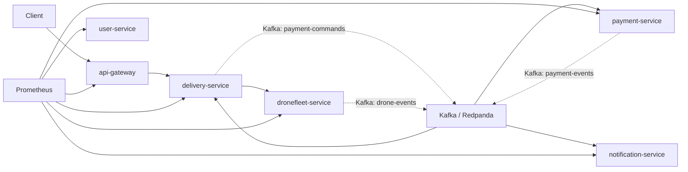

# Shipping on the Air - Assignment 3

## Rapport complet, guide de test et support de démonstration

### Auteur

Antoine Oliver

### Contexte

Ce document résume les modifications apportées au projet issu de l’assignment 2 afin de satisfaire les exigences de l’assignment 3:

- adoption d’une architecture orientée événements pour un microservice choisi
- utilisation de Kafka comme middleware
- définition de 2 SLOs et mesure des SLIs associés
- préparation d’un déploiement Kubernetes
- fourniture d’un guide de test complet pour comprendre, démontrer et expliquer le projet

---

## 1. Résumé exécutif

Le microservice sélectionné pour la réingénierie event-driven est `payment-service`.

Avant les modifications:

- `delivery-service` appelait encore `payment-service` en HTTP synchrone pour demander un paiement ou un remboursement
- `payment-service` publiait déjà des événements métier sur Kafka, mais ne recevait pas encore ses commandes métier de manière asynchrone

Après les modifications:

- `delivery-service` publie désormais des commandes Kafka sur le topic `payment-commands`
- `payment-service` consomme ces commandes Kafka
- `payment-service` continue de publier ses événements métier sur le topic `payment-events`
- `delivery-service` et `notification-service` réagissent aux événements produits
- les métriques métier liées à cette chaîne ont été ajoutées pour supporter les SLIs/SLOs
- un manifest Kubernetes complet a été ajouté pour déployer le système

Le résultat est une architecture plus découplée et plus proche d’un fonctionnement orienté événements, tout en restant cohérente avec le code existant.

---

## 2. Vue d’ensemble de l’architecture finale

### Microservices présents

- `api-gateway`
- `user-service`
- `delivery-service`
- `payment-service`
- `dronefleet-service`
- `notification-service`
- `prometheus`
- `kafka` via Redpanda

### Point clé de l’assignment 3

La chaîne de paiement est désormais pilotée par événements:

1. un client appelle `api-gateway`
2. `api-gateway` transmet au `delivery-service`
3. `delivery-service` publie une commande Kafka sur `payment-commands`
4. `payment-service` consomme cette commande
5. `payment-service` exécute le traitement métier
6. `payment-service` publie le résultat sur `payment-events`
7. `delivery-service` adapte sa saga
8. `notification-service` consomme aussi les événements et génère des notifications

### Flux logique simplifié



---

## 3. Ce qui a été ajouté ou modifié

### 3.1 Refonte event-driven de `payment-service`

#### Côté `delivery-service`

Le composant d’intégration paiement a été réécrit.

Avant:

- `PaymentAdapter` envoyait des requêtes HTTP vers `payment-service`

Maintenant:

- `PaymentAdapter` publie une commande Kafka
- deux types de commandes existent:
  - `REQUEST_PAYMENT`
  - `REQUEST_REFUND`

Fichiers importants:

- [PaymentAdapter.java](/home/antoineoliver/projets/SAP/A3/sota-2/delivery-service/src/main/java/delivery_service/infrastructure/adapter/PaymentAdapter.java)
- [PaymentCommand.java](/home/antoineoliver/projets/SAP/A3/sota-2/delivery-service/src/main/java/delivery_service/infrastructure/event/PaymentCommand.java)
- [DeliveryServiceMain.java](/home/antoineoliver/projets/SAP/A3/sota-2/delivery-service/src/main/java/delivery_service/infrastructure/DeliveryServiceMain.java)

#### Côté `payment-service`

Un consumer Kafka a été ajouté:

- `PaymentCommandListener` écoute `payment-commands`
- lors de la réception d’une commande:
  - création d’un paiement si nécessaire
  - démarrage du paiement ou du remboursement
  - publication des événements de sortie existants sur `payment-events`

Fichiers importants:

- [PaymentCommandListener.java](/home/antoineoliver/projets/SAP/A3/sota-2/payment-service/src/main/java/payment_service/infrastructure/event/PaymentCommandListener.java)
- [PaymentCommand.java](/home/antoineoliver/projets/SAP/A3/sota-2/payment-service/src/main/java/payment_service/infrastructure/event/PaymentCommand.java)
- [PaymentServiceImpl.java](/home/antoineoliver/projets/SAP/A3/sota-2/payment-service/src/main/java/payment_service/application/service/PaymentServiceImpl.java)

### 3.2 Ajout des métriques SLI/SLO

Le fichier suivant a été ajouté:

- [PaymentMetrics.java](/home/antoineoliver/projets/SAP/A3/sota-2/payment-service/src/main/java/payment_service/infrastructure/metrics/PaymentMetrics.java)

Il mesure:

- le nombre de commandes paiement reçues
- le nombre de commandes terminées
- le nombre de commandes rejetées
- la durée de traitement bout-en-bout

### 3.3 Configuration Kafka et Prometheus

Les fichiers `application.yml` ont été mis à jour pour:

- rendre `SPRING_KAFKA_BOOTSTRAP_SERVERS` configurable
- déclarer les topics
- exposer les métriques Prometheus
- configurer l’histogramme de latence pour le paiement

### 3.4 Déploiement Kubernetes

Un manifest complet a été ajouté:

- [k8s/shipping-on-the-air.yaml](/home/antoineoliver/projets/SAP/A3/sota-2/k8s/shipping-on-the-air.yaml)

Ce fichier contient:

- le namespace
- Kafka
- tous les Deployments
- tous les Services
- Prometheus
- les probes de santé
- une exposition `NodePort` pour `api-gateway` et `prometheus`

### 3.5 Documentation supplémentaire

Deux documents ont été ajoutés:

- [ASSIGNMENT3.md](/home/antoineoliver/projets/SAP/A3/sota-2/ASSIGNMENT3.md)
- [GUIDE_ASSIGNMENT3_PDF_READY.md](/home/antoineoliver/projets/SAP/A3/sota-2/GUIDE_ASSIGNMENT3_PDF_READY.md)

---

## 4. Pourquoi `payment-service` était le meilleur candidat

Ce choix est défendable oralement et techniquement.

### Arguments

`payment-service` était le meilleur candidat parce que:

- il possède déjà un cycle métier naturellement événementiel
- il manipulait déjà des événements métier comme `PaymentInitiatedEvent`, `PaymentSucceededEvent`, `PaymentFailedEvent`, `RefundSucceededEvent`
- il publiait déjà ses résultats sur Kafka
- le principal point encore synchrone était la réception de la commande, donc le passage au modèle event-driven était naturel
- cette modification enlève une dépendance HTTP critique entre `delivery-service` et `payment-service`

### Phrase simple pour l’oral

On n’a pas choisi un service au hasard: on a choisi celui dont le modèle métier se prêtait le mieux à un échange par événements, et dont l’intégration était déjà partiellement orientée Kafka.

---

## 5. SLOs et SLIs

### SLO 1 - Taux de complétion des commandes de paiement

Objectif:

- 99% des commandes reçues par `payment-service` doivent atteindre un état terminal

SLI mesuré:

- ratio entre les commandes terminées et les commandes reçues

Métriques utilisées:

- `shipping_payment_commands_received_total`
- `shipping_payment_commands_completed_total`
- `shipping_payment_commands_rejected_total`

Exemple de requête PromQL:

```promql
sum(rate(shipping_payment_commands_completed_total[5m]))
/
sum(rate(shipping_payment_commands_received_total[5m]))
```

### SLO 2 - Latence des commandes de paiement

Objectif:

- 95% des commandes de paiement ou de remboursement doivent se terminer en moins de 5 secondes

SLI mesuré:

- durée entre la réception du message Kafka dans `payment-service` et la publication de l’événement terminal métier

Métrique utilisée:

- `shipping_payment_command_duration_seconds`

Exemple de requête PromQL:

```promql
histogram_quantile(
  0.95,
  sum by (le, command) (
    rate(shipping_payment_command_duration_seconds_bucket[5m])
  )
)
```

### Comment l’expliquer simplement

Le premier SLO vérifie si les commandes arrivent bien à leur fin.

Le second SLO vérifie si elles arrivent à leur fin assez vite.

---

## 6. Préparation de l’environnement

### Prérequis

Il faut avoir:

- Java 17 ou 21 selon les images utilisées
- Docker et Docker Compose
- `kubectl` si tu veux tester Kubernetes
- `jq` pour lire facilement les réponses JSON

### Répertoire du projet

```bash
cd /home/antoineoliver/projets/SAP/A3/sota-2
```

Ou depuis PowerShell / UNC:

```powershell
cd \\wsl.localhost\Ubuntu\home\antoineoliver\projets\SAP\A3\sota-2
```

---

## 7. Commandes de build et de vérification automatique

### Build global

```bash
bash ./gradlew clean build
```

### Tests ciblés utilisés pour valider les modifications de l’assignment 3

```bash
bash ./gradlew :delivery-service:test \
  --tests 'delivery_service.infrastructure.adapter.PaymentAdapterIntegrationTest' \
  --tests 'delivery_service.application.saga.DeliverySagaOrchestratorUnitTest'
```

```bash
bash ./gradlew :payment-service:test \
  --tests 'payment_service.infrastructure.event.PaymentCommandListenerUnitTest' \
  --tests 'payment_service.infrastructure.controller.PaymentControllerComponentTest' \
  --tests 'payment_service.domain.model.PaymentEventSourcingUnitTest' \
  --tests 'payment_service.infrastructure.repository.InMemoryPaymentRepositoryIntegrationTest'
```

### Si tu veux lancer tout le projet en tests

```bash
bash ./gradlew test
```

### Ce que tu peux dire à l’oral

J’ai validé la partie event-driven en testant:

- la publication de commande Kafka côté `delivery-service`
- la consommation de commande côté `payment-service`
- la persistance événementielle du paiement
- le contrôleur de paiement
- la saga côté livraison

---

## 8. Démarrage du projet avec Docker Compose

### Lancer le système

```bash
docker compose build
docker compose up -d
```

Ou avec le script existant:

```bash
bash ./run_all_docker.sh
```

### Vérifier les conteneurs

```bash
docker compose ps
```

### Vérifier les logs

```bash
docker compose logs -f api-gateway
docker compose logs -f delivery-service
docker compose logs -f payment-service
docker compose logs -f dronefleet-service
docker compose logs -f notification-service
docker compose logs -f kafka
```

### Adresses utiles

- gateway: `http://localhost:8080`
- delivery-service: `http://localhost:8081`
- user-service: `http://localhost:8082`
- payment-service: `http://localhost:8083`
- dronefleet-service: `http://localhost:8084`
- notification-service: `http://localhost:8085`
- prometheus: `http://localhost:9090`

---

## 9. Authentification via le gateway

Le gateway protège la plupart des routes `/api/**`.

Endpoints publics:

- `POST /api/users/register`
- `POST /api/auth/login`

### 9.1 Enregistrer un utilisateur

```bash
USER_RESPONSE=$(curl -s -X POST \
  "http://localhost:8080/api/users/register?name=Antoine&email=antoine@test.com&password=AnTOIne1234")

echo "$USER_RESPONSE" | jq

USER_ID=$(echo "$USER_RESPONSE" | jq -r '.id')
echo "$USER_ID"
```

Réponse attendue:

```json
{
  "id": "USER-...",
  "email": "antoine@test.com"
}
```

### 9.2 Obtenir un token JWT

```bash
curl -X POST \
  "http://localhost:8080/api/auth/login?userId=$USER_ID"
```

### 9.3 Exporter le token en variable shell

```bash
TOKEN=$(curl -s -X POST "http://localhost:8080/api/auth/login?userId=$USER_ID" | jq -r '.token')
```

Puis utiliser:

```bash
-H "Authorization: Bearer $TOKEN"
```

---

## 10. Vérifications techniques de base

### Santé des services

```bash
curl http://localhost:8080/internal-health
curl http://localhost:8081/internal-health
curl http://localhost:8082/internal-health
curl http://localhost:8083/internal-health
curl http://localhost:8084/internal-health
curl http://localhost:8085/internal-health
```

### Métriques Prometheus

```bash
curl http://localhost:8080/metrics
curl http://localhost:8083/metrics | grep shipping_payment
```

### Vérifier Prometheus dans le navigateur

Ouvrir:

- `http://localhost:9090`

Requêtes utiles:

```promql
shipping_payment_commands_received_total
```

```promql
shipping_payment_commands_completed_total
```

```promql
shipping_payment_command_duration_seconds_count
```

---

## 11. Scénario classique complet de bout en bout

Ce scénario est le plus important pour une démonstration.

### Étape 1 - créer une base de drones

Attention: les paramètres corrects sont `latitude` et `longitude`.

```bash
curl -X POST \
  -H "Authorization: Bearer $TOKEN" \
  "http://localhost:8080/api/drones/base?name=DEFENSE&latitude=48.8924&longitude=2.2369&capacity=10"
```

Réponse typique:

```json
{
  "baseId": "DEFENSE",
  "latitude": 48.8924,
  "longitude": 2.2369,
  "capacity": 10
}
```

### Étape 2 - créer un drone

```bash
curl -X POST \
  -H "Authorization: Bearer $TOKEN" \
  "http://localhost:8080/api/drones/drone?baseId=DEFENSE"
```

Réponse typique:

```json
{
  "droneId": "D-00001",
  "baseId": "DEFENSE"
}
```

### Étape 3 - créer une livraison

```bash
DELIVERY_ID=$(curl -s -X POST \
  "http://localhost:8080/api/deliveries" \
  -H "Authorization: Bearer $TOKEN" \
  -H "Content-Type: application/json" \
  -d '{
    "userId": "'"$USER_ID"'",
    "pickupLocationLat": 48.8566,
    "pickupLocationLon": 2.3522,
    "dropoffLocationLat": 48.8647,
    "dropoffLocationLon": 2.3490,
    "weight": 2.1,
    "requestedTimeStart": "2026-01-14T14:00:00Z",
    "requestedTimeEnd": "2026-01-14T16:00:00Z"
  }' | tr -d '"')
```

Afficher l’identifiant:

```bash
echo "$DELIVERY_ID"
```

### Étape 4 - démarrer la livraison

```bash
curl -X POST \
  -H "Authorization: Bearer $TOKEN" \
  "http://localhost:8080/api/deliveries/$DELIVERY_ID/start"
```

### Étape 5 - calculer l’identifiant de paiement

L’identifiant suit le format:

```text
<userId>_<deliveryId>
```

Exemple:

```bash
PAYMENT_ID="${USER_ID}_${DELIVERY_ID}"
echo "$PAYMENT_ID"
```

### Étape 6 - vérifier l’état du paiement

```bash
curl -H "Authorization: Bearer $TOKEN" \
  "http://localhost:8080/api/payments/$PAYMENT_ID"
```

### Étape 7 - vérifier la saga de livraison

```bash
curl -H "Authorization: Bearer $TOKEN" \
  "http://localhost:8080/api/deliveries/$DELIVERY_ID/saga" | jq
```

### Étape 8 - suivre le statut de la livraison

```bash
curl -H "Authorization: Bearer $TOKEN" \
  "http://localhost:8080/api/deliveries/$DELIVERY_ID/status" | jq
```

### Étape 9 - suivre le temps restant

```bash
curl -H "Authorization: Bearer $TOKEN" \
  "http://localhost:8080/api/deliveries/$DELIVERY_ID/remaining-time" | jq
```

### Étape 10 - suivre l’état du drone

```bash
curl -H "Authorization: Bearer $TOKEN" \
  "http://localhost:8080/api/drones/drone?droneId=D-00001" | jq
```

### Boucle de monitoring

```bash
while true; do
  echo "----- STATUS -----"
  curl -s -H "Authorization: Bearer $TOKEN" \
    "http://localhost:8080/api/deliveries/$DELIVERY_ID/status" | jq
  echo "----- SAGA -----"
  curl -s -H "Authorization: Bearer $TOKEN" \
    "http://localhost:8080/api/deliveries/$DELIVERY_ID/saga" | jq
  echo "----- PAYMENT -----"
  curl -s -H "Authorization: Bearer $TOKEN" \
    "http://localhost:8080/api/payments/$PAYMENT_ID" | jq
  sleep 5
done
```

### Résultat attendu

Sur un scénario nominal:

- le paiement passe à `PAYMENT_CONFIRMED`
- la saga de livraison avance
- un drone est affecté
- la livraison passe progressivement à un état terminal
- des notifications sont émises

---

## 12. Comment prouver que la partie event-driven fonctionne vraiment

Ce point est très important à expliquer.

### 12.1 Vérification par les logs du `delivery-service`

Chercher les logs de publication de commande:

```bash
docker compose logs delivery-service | grep PAYMENT-COMMAND
```

Tu devrais voir un log du type:

```text
[KAFKA][DELIVERY][PAYMENT-COMMAND]
```

### 12.2 Vérification par les logs du `payment-service`

Chercher la réception de commande:

```bash
docker compose logs payment-service | grep "\[KAFKA\]\[PAYMENT\]\[COMMAND\]"
```

### 12.3 Vérification par les événements métier de paiement

```bash
curl -H "Authorization: Bearer $TOKEN" \
  "http://localhost:8080/api/payments/$PAYMENT_ID/events" | jq
```

Tu dois obtenir un historique métier du type:

- `PaymentInitiatedEvent`
- `PaymentSucceededEvent`

ou:

- `PaymentInitiatedEvent`
- `PaymentFailedEvent`

### 12.4 Vérification par les métriques

```bash
curl -s http://localhost:8083/metrics | grep shipping_payment
```

Tu dois voir des métriques comme:

- `shipping_payment_commands_received_total`
- `shipping_payment_commands_completed_total`
- `shipping_payment_command_duration_seconds`

### Phrase utile pour l’oral

Je prouve que la communication n’est plus synchrone entre `delivery-service` et `payment-service` car je vois:

- la publication de la commande dans les logs du producer
- la consommation de la commande dans les logs du consumer
- les événements de sortie sur Kafka
- les métriques métier qui comptent ces messages

---

## 13. Vérifier les notifications

Les notifications sont simulées par `notification-service`.

Les messages sont écrits dans:

- `logs/emails.log` côté projet
- `/app/logs/emails.log` dans le conteneur

### Lire le fichier des notifications

```bash
cat logs/emails.log
```

Ou:

```bash
tail -f logs/emails.log
```

Ou encore:

```bash
docker compose exec notification-service sh -lc "cat /app/logs/emails.log"
```

### Ce que tu dois y voir

Des messages simulés tels que:

- `Welcome!`
- `Payment Success`
- `Payment Failed`
- `Delivery Created`
- `Delivery Started`
- `Delivery Completed`

---

## 14. Scénarios de démonstration recommandés

### Scénario A - Démarrage et santé

Objectif:

- montrer que tous les services démarrent
- montrer que Prometheus scrape bien les métriques

Commandes:

```bash
docker compose up -d
docker compose ps
curl http://localhost:8083/internal-health
curl http://localhost:8083/metrics | grep shipping_payment
```

### Scénario B - Nominal complet

Objectif:

- montrer la création d’utilisateur
- l’authentification
- la création de base et de drone
- la création de livraison
- le déclenchement du paiement par événement
- la progression de la saga

Commandes:

- celles de la section 11

### Scénario C - Inspection de la trace métier

Objectif:

- montrer l’event sourcing et la traçabilité de `payment-service`

Commande:

```bash
curl -H "Authorization: Bearer $TOKEN" \
  "http://localhost:8080/api/payments/$PAYMENT_ID/events" | jq
```

Ce scénario est très utile pour expliquer pourquoi le service paiement était un bon candidat.

### Scénario D - Démonstration d’une issue paiement

Le simulateur externe de paiement fonctionne de manière probabiliste:

- succès paiement: 80%
- succès remboursement: 90%

Donc, pour montrer un cas d’échec naturel:

- rejoue le scénario nominal plusieurs fois jusqu’à obtenir `PAYMENT_FAILED`

Commande de vérification:

```bash
curl -H "Authorization: Bearer $TOKEN" \
  "http://localhost:8080/api/payments/$PAYMENT_ID"
```

### Scénario E - Démonstration forcée d’un échec paiement

Pour une démonstration plus directe, tu peux appeler manuellement le callback exposé par le service paiement via le gateway.

Commande:

```bash
curl -X POST \
  -H "Authorization: Bearer $TOKEN" \
  "http://localhost:8080/api/payments/$PAYMENT_ID/failed"
```

Puis vérifier:

```bash
curl -H "Authorization: Bearer $TOKEN" \
  "http://localhost:8080/api/payments/$PAYMENT_ID/events" | jq
```

Et:

```bash
curl -H "Authorization: Bearer $TOKEN" \
  "http://localhost:8080/api/deliveries/$DELIVERY_ID/saga" | jq
```

Remarque:

- ce scénario simule un retour du processeur de paiement
- il est pratique pour la démonstration
- il peut entrer en concurrence avec le simulateur asynchrone naturel si tu attends trop longtemps

---

## 15. Déploiement Kubernetes

### 15.1 Construire les images locales

```bash
bash ./gradlew clean build
docker build -t api-gateway:latest ./api-gateway
docker build -t delivery-service:latest ./delivery-service
docker build -t payment-service:latest ./payment-service
docker build -t dronefleet-service:latest ./dronefleet-service
docker build -t user-service:latest ./user-service
docker build -t notification-service:latest ./notification-service
```

### 15.2 Déployer sur Kubernetes

```bash
kubectl apply -f k8s/shipping-on-the-air.yaml
```

### 15.3 Vérifier le namespace

```bash
kubectl get ns
kubectl get all -n shipping-on-the-air
kubectl get svc -n shipping-on-the-air
```

### 15.4 Vérifier les pods

```bash
kubectl get pods -n shipping-on-the-air -w
```

### 15.5 Voir les logs

```bash
kubectl logs deployment/payment-service -n shipping-on-the-air
kubectl logs deployment/delivery-service -n shipping-on-the-air
kubectl logs deployment/notification-service -n shipping-on-the-air
```

### 15.6 Accéder au gateway et à Prometheus

Si tu utilises les `NodePort` du manifest:

- gateway: `http://localhost:30080`
- prometheus: `http://localhost:30090`

Sinon en port-forward:

```bash
kubectl port-forward svc/api-gateway 8080:8080 -n shipping-on-the-air
kubectl port-forward svc/prometheus 9090:9090 -n shipping-on-the-air
```

### Ce que tu peux expliquer sur Kubernetes

Le manifest montre:

- la découverte de service via les `Service`
- le load balancing via les Services Kubernetes
- les `readinessProbe` et `livenessProbe`
- la réplication de certains services stateless
- la séparation logique par namespace

---

## 16. Limites actuelles à connaître

Il est important de montrer que tu maîtrises aussi les limites.

### Limites techniques

- plusieurs services utilisent encore de la mémoire locale et non une base partagée
- cela limite le scale horizontal réel de certains services métier
- le paiement simulé est probabiliste, donc les démonstrations d’échec naturel ne sont pas strictement déterministes
- Kubernetes est prêt côté manifests, mais une mise en production réelle nécessiterait une stratégie d’images et de persistance plus robuste

### Comment bien le formuler

L’architecture répond à l’objectif pédagogique de l’assignment 3, mais certains services restent basés sur du stockage en mémoire, ce qui limite la scalabilité métier complète dans une vraie production.

---

## 17. Questions probables et réponses prêtes

### Pourquoi ne pas avoir choisi `notification-service`?

Parce qu’il était déjà essentiellement consommateur d’événements Kafka. Le gain architectural principal aurait été faible.

### Pourquoi `payment-service`?

Parce qu’il possédait déjà une logique métier naturellement orientée événements, avec un historique d’états et des événements Kafka déjà présents.

### Qu’est-ce qui est devenu asynchrone exactement?

La commande de paiement et de remboursement entre `delivery-service` et `payment-service`.

### Où voit-on la preuve que cela fonctionne?

Dans:

- les logs Kafka producer/consumer
- les événements disponibles via `/api/payments/{paymentId}/events`
- les métriques Prometheus

### Pourquoi avoir défini ces deux SLOs?

Parce qu’ils mesurent les deux dimensions essentielles de ce nouveau flux:

- est-ce que les commandes aboutissent?
- est-ce qu’elles aboutissent assez vite?

### Pourquoi certaines réplications Kubernetes restent à 1?

Parce que les services concernés stockent encore leur état en mémoire locale.

---

## 18. Plan de démo conseillé en 5 à 8 minutes

### Démo courte

1. montrer `docker compose ps`
2. montrer `http://localhost:9090`
3. enregistrer un utilisateur
4. récupérer un JWT
5. créer base et drone
6. créer et démarrer une livraison
7. montrer les logs du `delivery-service`
8. montrer les logs du `payment-service`
9. montrer `/api/payments/{paymentId}/events`
10. montrer `/metrics` avec les métriques `shipping_payment_*`

### Démo plus complète

Ajouter:

11. `logs/emails.log`
12. `/api/deliveries/{deliveryId}/saga`
13. le manifest Kubernetes
14. les deux requêtes PromQL des SLIs

---

## 19. Commandes récapitulatives les plus utiles

### Build

```bash
bash ./gradlew clean build
```

### Lancer avec Docker

```bash
docker compose build
docker compose up -d
```

### Token

```bash
TOKEN=$(curl -s -X POST "http://localhost:8080/api/auth/login?userId=$USER_ID" | jq -r '.token')
```

### Métriques paiement

```bash
curl -s http://localhost:8083/metrics | grep shipping_payment
```

### Logs event-driven

```bash
docker compose logs delivery-service | grep PAYMENT-COMMAND
docker compose logs payment-service | grep "\[KAFKA\]\[PAYMENT\]\[COMMAND\]"
```

### Event sourcing

```bash
curl -H "Authorization: Bearer $TOKEN" \
  "http://localhost:8080/api/payments/$PAYMENT_ID/events" | jq
```

### Saga

```bash
curl -H "Authorization: Bearer $TOKEN" \
  "http://localhost:8080/api/deliveries/$DELIVERY_ID/saga" | jq
```

### Notifications

```bash
tail -f logs/emails.log
```

### Kubernetes

```bash
kubectl apply -f k8s/shipping-on-the-air.yaml
kubectl get all -n shipping-on-the-air
kubectl port-forward svc/api-gateway 8080:8080 -n shipping-on-the-air
kubectl port-forward svc/prometheus 9090:9090 -n shipping-on-the-air
```

---

## 20. Conclusion

Le projet satisfait les objectifs de l’assignment 3:

- un microservice pertinent a été refactoré selon une logique event-driven
- Kafka est utilisé comme middleware de communication asynchrone
- deux SLOs et leurs SLIs ont été définis et instrumentés
- un déploiement Kubernetes a été préparé
- un guide complet de test et de démonstration est disponible

Le point le plus fort du travail est la transformation de la chaîne de paiement, qui est désormais à la fois:

- plus découplée
- plus observable
- plus facile à démontrer
- plus facile à défendre techniquement à l’oral

---

## 21. Fichiers à citer pendant ta présentation

- [GUIDE_ASSIGNMENT3_PDF_READY.md](/home/antoineoliver/projets/SAP/A3/sota-2/GUIDE_ASSIGNMENT3_PDF_READY.md)
- [ASSIGNMENT3.md](/home/antoineoliver/projets/SAP/A3/sota-2/ASSIGNMENT3.md)
- [k8s/shipping-on-the-air.yaml](/home/antoineoliver/projets/SAP/A3/sota-2/k8s/shipping-on-the-air.yaml)
- [PaymentAdapter.java](/home/antoineoliver/projets/SAP/A3/sota-2/delivery-service/src/main/java/delivery_service/infrastructure/adapter/PaymentAdapter.java)
- [PaymentCommandListener.java](/home/antoineoliver/projets/SAP/A3/sota-2/payment-service/src/main/java/payment_service/infrastructure/event/PaymentCommandListener.java)
- [PaymentMetrics.java](/home/antoineoliver/projets/SAP/A3/sota-2/payment-service/src/main/java/payment_service/infrastructure/metrics/PaymentMetrics.java)
